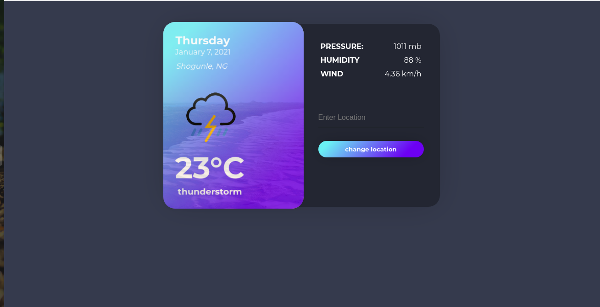
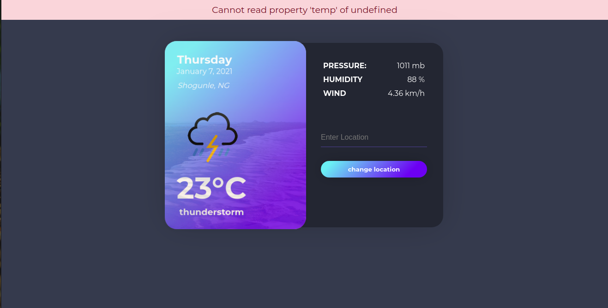

# Weather-App

> In this project i use the fetch api and the knowledge of async programming to create a weather app that detects your current weather of a location and any weather location of your choice




## Built With

- Javascript ES6
- OpenWeatherMap API
- WebPack
- HTML
- CSS
- VS Code

## How to Install

- Install Node in your system. To install Node, you can read the [Documentation](https://nodejs.org/en/download/package-manager/)
- Clone the repo or download the zip file into your machine.
  ```
  git clone https://github.com/chinweokwu/Weather-App.git
  ```
- On your terminal, CD into the Weather-App folder and run
  ```
  npm install
  ```
- This will install all the dependancies.

- Then open the index.html in your browser (or use a local server)

## Author 

👤 **Paul chinweokwu Morah**

- Github: [@paulmorah](https://github.com/chinweokwu)
- Twitter: [@Morah89820846](https://twitter.com/Morah89820846)
- Linkedin: [Paul Chinweoku Morah](https://www.linkedin.com/in/morah-paul/)

## 🤝 Contributing

Contributions, issues and feature requests are welcome!. Feel free to check the [issues page](https://github.com/chinweokwu/Weather-App/issues).

## Show your support

Give a ⭐️ if you like this project!
